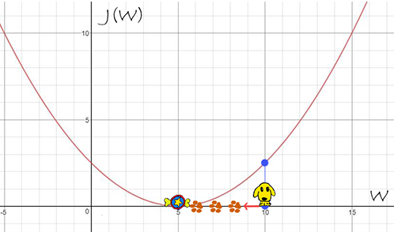

[TOC]

# 机器学习指南

## 激活函数

|    name    |                           Function                           |                          Derivative                          |
| :--------: | :----------------------------------------------------------: | :----------------------------------------------------------: |
|  sigmoid   |                  $g(z)=\frac{1}{1+e^{-z}}$                   |                        $g(z)(1-g(z))$                        |
|    tanh    |             $g(z)=\frac{e^z-e^{-z}}{e^z+e^{-z}}$             |                         $1-(g(z))^2$                         |
|    ReLU    |                       $g(z)=\max(0,z)$                       |         $\begin{cases}0, &z<0\\1, &z>0 \end{cases}$          |
| Leaky ReLU |                 $g(z)=\max(\alpha\cdot z,z)$                 |       $\begin{cases}\alpha, &z<0\\1, &z>0 \end{cases}$       |
|    ELU     | $g(z)=\begin{cases}z, &\text{if $z>0$}\\\alpha(e^z-1),&\text{otherwise}\end{cases}$ | $\begin{cases}\alpha\cdot e^z, &z\leq0\\1, &z>0 \end{cases}$ |


## 优化算法

### 梯度下降法

梯度下降法是用来寻找一个目标函数的局部最优解的迭代方法，其伪代码定义如下：

```markdown
Repeat{
    W := W - learning_rate * dJ(W)/dW
}
```

其中 $\frac{\partial J(W)}{\partial W}$ 表示参数 $W$ 的梯度，以二次函数为例，梯度下降法的过程如下：




